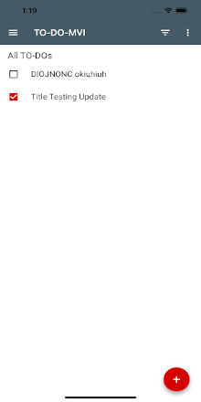
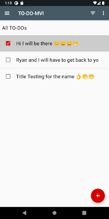

# Todo-Mvi-Kotlin-Multiplatform

### Summary

This project sets up the use of Kotlin Multiplatform using a SQLDelight database and the Kotlin Reaktive framework to create an Android and IOS application inspired by the sample from the Google Android Architecture Samples repository

 

To start this project you need :

- Android Studio 4.2.2
- Gradle Distributions 7.0.1-bin
- Kotlin Gradle Plugin 1.5.21
- XCode 12.4

### Dependencies for iOS Application

* [Todo MVI RxSwift Swift](https://github.com/gironnetd/todo-mvi-rxswift-swift) by myself
* [RxSwift](https://github.com/ReactiveX/RxSwift)
* [Reaktive](https://github.com/badoo/Reaktive)
* [Material Component for iOS](https://github.com/material-components/material-components-ios)

### Dependencies for Android Application

* [Todo MVI RxKotlin Kotlin](https://github.com/oldergod/android-architecture) by oldergod
* [RxKotlin](https://github.com/ReactiveX/RxKotlin)
* [Reaktive](https://github.com/badoo/Reaktive)

### Dependencies for Android Application

* [SQLDelight](https://cashapp.github.io/sqldelight/)
* [Reaktive](https://github.com/badoo/Reaktive)
* [TouchLab Stately](https://github.com/touchlab/Stately)

